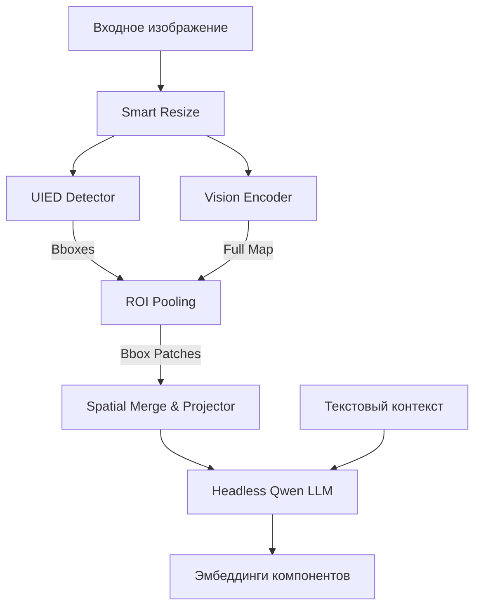

# Visual Language UI Embedder

Пайплайн на базе семейства моделей **Qwen2.5-VL** для извлечения контекстных семантических эмбеддингов UI-компонентов. Система позволяет преобразовывать элементы интерфейса в векторное представление, учитывающее как визуальные особенности самого элемента, так и глобальный контекст всего экрана и текстовое описание задачи.

## 🎯 Назначение

Проект предназначен для создания продвинутых RAG-систем (Retrieval-Augmented Generation), работающих с графическими интерфейсами. Основная цель — обеспечить высокоточный поиск UI-элементов по текстовым запросам («кнопка входа», «поле ввода email» и т.д.), понимая их функциональное назначение в конкретном контексте.

---

## 🏗️ Архитектура

Система реализует иерархический подход к кодированию визуальной информации:

1.  **Smart Resize**: Динамическое изменение размера изображения с сохранением пропорций и выравниванием по сетке патчей (28px).
2.  **UIED Detection**: Детекция границ UI-компонентов с использованием методов компьютерного зрения (OpenCV).
3.  **Box-Aware Visual Encoder (ViT-32L)**:
    *   Извлечение признаков всего изображения (**Global Sequence**).
    *   **ROI Pooling**: Прицельное извлечение патчей для каждого обнаруженного bbox (**Local Sequences**).
4.  **Spatial Merge & MLP**: Группировка пространственных патчей 2×2 и проекция в пространство LLM (3584-dim для 7B версии).
5.  **Headless LLM (Qwen 28L)**: Обработка визуальных токенов совместно с текстовым промптом для получения финальных контекстных эмбеддингов.

### Схема последовательности (Inference)


**Интерактивная диаграмма:** Откройте [vit_diagram.html](vit_diagram.html) для детального изучения внутренней структуры ViT и Spatial Merge.

---

## 🚀 Ключевые возможности

*   **Мульти-модальность**: Полная поддержка Qwen2.5-VL (2B, 3B, 7B, 72B). Автоматическая настройка архитектуры под выбранную модель.
*   **Контекстуализация**: В отличие от простых кропов (CLIP), каждый эмбеддинг "знает", что находится вокруг него.
*   **Обучение (LoRA Triplet Loss)**: Встроенный механизм дообучения для выравнивания (alignment) текстовых запросов и визуальных признаков.
*   **Генерация описаний**: Скрипт для автоматического создания текстовых описаний для каждого UI-элемента на основе VLM.
*   **Предпроцессинг**: Интегрированная очистка и нормализация текста для улучшения качества поиска.

---

## 🛠️ Основные модули

### 🔹 Инференс и обработка
- `main.py`: Основной пайплайн генерации эмбеддингов.
- `box_aware_visual_encoder.py`: Реализация кастомного энкодера с поддержкой ROI Pooling и Spatial Merge.
- `uied_detector.py`: Детектор UI-компонентов на базе OpenCV.
- `config.py`: Централизованная конфигурация (выбор модели, параметры девайса, промпты).

### 🔹 Обучение (Training)
- `training/train_lora_triplet.py`: Скрипт для fine-tuning модели. Использует **Triplet Margin Loss** и **LoRA** для эффективного обучения на ограниченном VRAM (от 15 ГБ).
- `training/triplet_dataset.json`: Пример структуры данных для обучения (Anchor, Positive, Negative).

### 🔹 Генерация и утилиты
- `generate_embeddings_text.py`: Генерация текстовых описаний для компонентов (VLM-to-Text).
- `text_preprocessing.py`: NLP-пайплайн для очистки текстового контекста.
- `verify_embeddings.py`: Скрипт для проверки косинусного сходства векторов.

---

## ⚡ Быстрый старт

### 1. Установка зависимостей
```bash
pip install -r requirements.txt
```

### 2. Запуск базового инференса
Положите изображение в `input_images/image_20_2.png` и запустите:
```bash
python main.py
```
Результат будет сохранен в `output/embeddings.json`.

### 3. Запуск дообучения (Fine-tuning)
Для выравнивания текстовых и визуальных пространств:
```bash
python training/train_lora_triplet.py
```

---

## ⚙️ Конфигурация (`config.py`)

Вы можете переключаться между моделями разного размера через алиасы:
```python
# Варианты: "2B", "3B", "7B", "72B"
config = UIEmbedderConfig.from_model_name("3B", device="cuda")
```

**Ключевые параметры:**
- `use_global_summary`: Добавлять ли "глобальный" токен изображения в начало последовательности (улучшает контекст).
- `use_retrieval_prompt`: Использовать ли специальные инструкции для поиска (E5-style).
- `max_dist`: Чувствительность группировки элементов в UIED-детекторе.

---

## ⚠️ Важные примечания

1.  **VRAM**: Для работы с 7B моделью требуется ~16-20 ГБ VRAM. Для обучения (даже с LoRA) рекомендуется использовать 2B или 3B версию на картах с 16 ГБ.
2.  **Retrieval Alignment**: Базовая модель Qwen2.5-VL обучена на генерацию. Для качественного RAG поиска настоятельно рекомендуется использовать обученный LoRA-адаптер из секции Training.
3.  **Debug Decoding**: Файл `decoded_embeddings.json` в папке `debug` служит только для визуальной проверки того, что видит модель. Не используйте эти тексты для поиска.

---

## 📝 Лицензия
MIT
